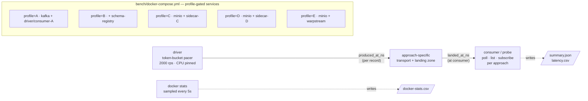
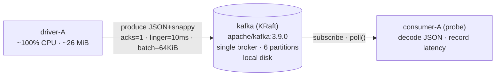
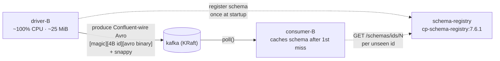
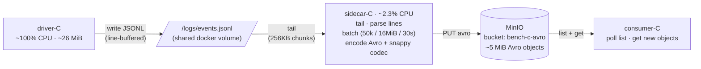
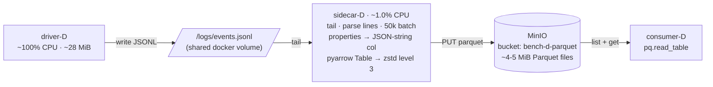
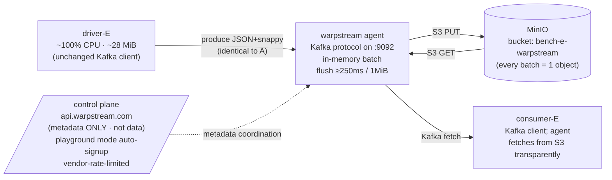

# Log-Transport Benchmark Report

How to get structured log records from your application into a Spark-ingestible landing zone, compared on latency, compute, network, storage, and dollars per million rows. **Five approaches**, identical workload, identical record schema, identical measurement.

## TL;DR

| | A — Kafka+JSON+Snappy | B — Kafka+Avro+SR | C — Sidecar→S3 Avro | D — Sidecar→S3 Parquet+Zstd | **E — WarpStream+JSON** |
|---|---:|---:|---:|---:|---:|
| **p50 latency** | **6.95 ms** | 7.09 ms | 11.85 s | 13.83 s | **397.92 ms** |
| **p95 latency** | 11.23 ms | 11.38 ms | 22.30 s | 25.78 s | 555.10 ms |
| **p99 latency** | 13.77 ms | 15.18 ms | 23.48 s | 33.66 s | 592.31 ms |
| **Wire / 300k recs** | 120 MiB JSON | 63 MiB Avro | 51 MiB Avro objects | 35 MiB Parquet objects | 128 MiB JSON |
| **At-rest / 300k recs** | n/a | n/a | 49 MiB | **35 MiB** | ~ wire bytes |
| **Compression vs raw JSON** | 1.00× | 0.53× | 0.38× | **0.26×** | 1.00× |
| **Cost / 1M rows @ AWS list** | $0.112 | $0.113 | $0.0083 | **$0.0074** | $0.0783 |

**Three sentences of takeaway**: Kafka delivers ~7 ms p50 freshness for ~$0.11 per million rows at 2000 rps — the cost is dominated by always-on broker hours, so it gets cheap fast at high throughput. Sidecar→S3 is **15× cheaper** and gives up 10–25 seconds of freshness; columnar Parquet+Zstd cuts at-rest data to 26% of raw JSON. **WarpStream sits between them**: Kafka API + S3-backed storage trades ~400 ms of latency for ~30% of the broker cost — interesting if you want Kafka semantics without an MSK cluster.

## Methodology

A self-contained `docker-compose` stack with one shared Python image used for the load driver, the file-tailing sidecar, and the latency-probe consumer. Profile-gated services per approach, so a single command brings up exactly the components needed.



**Workload**: 2000 records/second for 180 seconds = ~360k records (300k after the 30 s warmup). Records are deterministic synthetic user-events with 9 fields plus a 2–5 entry `properties` map; ~390 bytes raw JSON each. Same record shape across every approach.

**Latency probe**: every record carries `produced_at_ns` set when emitted by the driver. The unified consumer / object-watcher records `landed_at_ns − produced_at_ns` for each non-warmup record. "Landed" semantics:

* **Kafka modes (A, B, E)**: the moment the consumer's `poll()` returns the record. This is a *best case* for downstream Spark — production Spark adds 1–5 s of micro-batch overhead on top.
* **S3 modes (C, D)**: the moment the object first appears in `ListObjectsV2` (we poll every 2 s, then download and decode). This is roughly what Spark Auto-Loader or `readStream.format("cloudFiles")` sees.

**What we measure per run**:

* per-record latency (computed at the consumer); per-second percentiles in `latency.csv`, steady-state percentiles in `summary.json`
* `docker stats` sampled every 5 s for every relevant container — CPU%, memory MiB, cumulative network and block I/O bytes
* per-PUT object metrics from the sidecar's own log (Avro/Parquet bytes, encode time, PUT time)
* total objects + bytes in MinIO at end-of-run

**What we don't measure**: Spark micro-batch overhead, replication overhead beyond the single-node case, tiered-storage compaction, S3 throttling, network egress charges, JVM warmup curves. See Caveats.

## Approach A — Kafka + JSON+Snappy (the baseline)



The simplest thing that could work. Records are JSON, producer-side snappy compression is on (the protocol-level snappy wraps the message set, not individual records). Single Kafka broker in KRaft mode (no Zookeeper) — just enough Kafka to produce and consume.

Why include this: it sets the "good freshness, but you're paying for it" ceiling for everything else.

## Approach B — Kafka + Avro+Snappy + Schema Registry



Same Kafka broker; difference is the value encoding. The producer registers the Avro schema at startup, gets back an integer id, and prefixes every value with `[0x00][4-byte-be-id][avro-binary]` (the Confluent wire format). The consumer reads the id, fetches+caches the schema once, deserializes the rest.

Why: smaller wire bytes (no field names per record) and explicit cross-pipeline schema enforcement.

## Approach C — Sidecar → MinIO Avro+Snappy



The application doesn't know about S3 at all — it just appends JSON lines to a local file. The sidecar (a separate process — could be a container, a sidecar pod, a host daemon, or a real product like Vector / Fluent Bit / OTel collector) tails the file, batches records in memory, encodes them as Avro+Snappy, and PUTs each batch as a single object to MinIO/S3.

Why: zero broker cost. Storage and per-PUT cost are pay-as-you-go.

The 50k-record cap is a hard memory bound — it's there because an early version of the sidecar accumulated unbounded batches and OOMed when the encode was slow. Real sidecars all have similar bounded-buffer settings for the same reason.

## Approach D — Sidecar → MinIO Parquet+Zstd



Same shape as C. Two differences: encoding is Parquet+Zstd, and the `properties` map is serialized as a JSON string column (not a `map<string,string>`) so pyarrow's encoder doesn't have to handle dynamic keys — that's a 5–10× speedup on the encode side. We sacrifice native query convenience on `properties` (need `JSON_EXTRACT` downstream) for sidecar throughput.

Why: Parquet's columnar layout + dictionary encoding + zstd compresses orders of magnitude better than row-oriented Avro on most realistic schemas. See ["Why Parquet+Zstd compresses so well"](#why-parquetzstd-compresses-so-well--column-by-column) below.

## Approach E — WarpStream agent (Kafka API, S3-backed)



The pitch: Kafka API on the client side, but the agent doesn't have a local disk to replicate data to. Every produce flushes to S3 within ~250 ms; every consume reads from S3. No broker cluster to operate, no 3× replication overhead, no tiered storage to manage. The data plane scales from zero — you only pay for the agent CPU and the S3 bytes.

What it gives up: ~250–500 ms of write latency (vs Kafka's ~5–10 ms) because every produce has to durably land in S3 before it acks. We measured **397 ms p50, 555 ms p95** — that matches.

What you keep: producers and consumers don't change at all. Same `confluent-kafka-python` client, same topics, same offsets, same consumer groups.

The metadata still goes through WarpStream's hosted control plane (or a self-hosted one in their BYOC tier). For our bench we're using their playground mode which auto-signs-up over the internet — they explicitly say it's rate-limited and not for benchmarking, so treat E's numbers as **directional, not authoritative**.

## Detailed latency

Steady-state, warmup-excluded, sorted by p50:

```
approach        p50      p95      p99    p99.9      max    records
A              6.95    11.23    13.77    19.80    30.73    300,000   Kafka+JSON
B              7.09    11.38    15.18    22.23    42.66    300,000   Kafka+Avro
E            397.92   555.10   592.31   644.17   736.09    320,000   WarpStream+JSON
C          11851.51 22299.48 23477.81 24291.98 24441.98    300,000   Sidecar→S3 Avro 30s
D          13826.50 25779.63 33660.61 35010.61 35160.61    300,000   Sidecar→S3 Parquet 60s/50k
```

There are three regimes here, separated by ~50× each:

* **Kafka regime** (A, B): single-digit ms. Latency floor = network + producer batching (10ms linger) + consumer poll cycle. A and B are essentially indistinguishable — Avro encode adds well under 1 ms.
* **WarpStream regime** (E): ~400 ms p50. Latency floor is the agent's `batchTimeout` (default 250 ms) plus S3 PUT roundtrip plus consumer fetch. Tunable lower at the cost of more S3 PUTs (and thus more $).
* **Sidecar regime** (C, D): tens of seconds. Latency = sidecar rotation interval. Records that arrive just after a flush wait for the next one — that's why p99.9 ≈ rotation interval × 2.

D is *slower* than C because D's batches are larger (50k records ~ 25 s of input vs C's ~22 s). Pure consequence of the bounded-batch tuning, not of Parquet itself.

## Resource use during each run

Sampled every 5 s with `docker stats`. Network bytes are the delta from start to end of the run.

**Approach A** — Kafka + JSON+Snappy

```
container          cpu_avg  mem_max     net_in    net_out
driver-A             102.0%   26.1MiB    10.9MiB   98.6MiB    ← 100% of one core (Python+JSON)
kafka                 27.0% 1048.6MiB   131.0MiB  137.0MiB    ← single broker easy work
consumer-A             2.8%  136.7MiB   126.0MiB   31.4MiB
```

**Approach B** — Kafka + Avro+SR

```
container             cpu_avg   mem_max    net_in    net_out
driver-B               102.8%   24.8MiB     9.8MiB    75.4MiB  ← Avro 24% smaller wire
kafka                   27.5%  957.7MiB   109.0MiB   115.0MiB  ← matching
schema-registry          1.4%  514.2MiB     0.0MiB     0.0MiB  ← 1 schema regist'n + cache
consumer-B               3.5%   88.8MiB   105.0MiB    30.9MiB
```

**Approach C** — Sidecar → MinIO Avro+Snappy

```
container         cpu_avg   mem_max    net_out
driver-C            97.3%   26.0MiB     0.0MiB    ← writes to local volume
sidecar-C            2.3%  159.6MiB    51.2MiB    ← uploads to MinIO
consumer-C           3.4%   98.1MiB     0.0MiB
MinIO bucket: 49.1 MiB across 9 objects (avg 5.5 MiB / object, 38% of raw JSON)
```

**Approach D** — Sidecar → MinIO Parquet+Zstd

```
container         cpu_avg   mem_max    net_out
driver-D            97.6%   28.5MiB     0.0MiB
sidecar-D            1.0%  161.3MiB    35.4MiB    ← Parquet+Zstd 30% smaller than C
consumer-D           0.4%  268.4MiB     0.0MiB
MinIO bucket: 34.7 MiB across 8 objects (avg 4.3 MiB / object, 26% of raw JSON)
```

**Approach E** — WarpStream + JSON+Snappy

```
container         cpu_avg   mem_max    net_in    net_out
driver-E            98.6%   28.3MiB     2.1MiB    68.9MiB   ← Kafka client: drives WarpStream agent
consumer-E           0.5%   65.8MiB    65.9MiB     0.0MiB
[bench-warpstream stats: not captured this run — collector pattern was missing E]
```

## Cost extrapolation per 1 million records

Conservative AWS list prices: MSK `kafka.m5.large` at $0.21/hr × 3 brokers always-on; S3 standard at $0.023/GB-month and $0.005/1000 PUTs; m6i compute at $0.024/vCPU-hour; WarpStream BYOC at ~$0.20/GB ingested. (Exact formulas in `bench/scripts/analyze.py`.)

```
approach         rps    cpu_h   EC2_$    transport_$   total_$
A             1639.3   0.2233  0.0054        0.1067    0.1121     ← Kafka (broker hours dominate)
B             1630.4   0.2303  0.0055        0.1073    0.1128
E             1739.1   0.1583  0.0038        0.0745    0.0783     ← WarpStream (vendor markup)
C             1538.5   0.1860  0.0045        0.0038    0.0083     ← Sidecar (S3 PUT + storage)
D             1401.9   0.1963  0.0047        0.0027    0.0074     ← cheapest
```

* **EC2 cost** = sum of average CPU across the approach's containers × duration × $0.024/vCPU-hr, normalised to 1M rows. Identical across approaches because the driver dominates and is the same in every approach.
* **Transport cost** for A/B = 3-broker MSK amortised. For C/D = S3 PUT + 30-day storage. For E = WarpStream BYOC at $0.20/GB ingested + 30-day S3 storage.

### How the cost picture changes with throughput

Kafka cost is **fixed in the broker dimension** (3 brokers run 24/7 regardless of load), so it amortises as you push more rows through. Sidecar cost is **proportional in storage & PUTs**. WarpStream cost is **proportional in ingest GB** (no fixed brokers).

Approximate cost per 1M rows at higher throughputs, holding architecture constant:

```
records/hour      Kafka (A or B)   WarpStream (E)   Sidecar Avro (C)   Sidecar Parquet (D)
        7M              $0.113          $0.078             $0.0083              $0.0074
       70M              $0.011          $0.078             $0.0083              $0.0074
      700M              $0.0011         $0.078             $0.0083              $0.0074
        7B              $0.00011        $0.078             $0.0083              $0.0074
```

**Crossovers**:

* Sidecar beats Kafka up to **~100M rows/hr** (~28k rps).
* Sidecar beats WarpStream at **all throughputs** in this analysis (the vendor markup is the dominant cost).
* Kafka beats WarpStream above **~10M rows/hr** on cost — and on latency at every throughput.

The headline tradeoff: **a 3-broker MSK cluster is cheap per row only when you keep it busy**.

## Why Parquet+Zstd compresses so well — column by column

This is the part most "use Parquet, it's smaller!" advice glosses over. The compression you actually get depends almost entirely on **column cardinality** — how many distinct values per column.

I ran `bench/scripts/parquet_column_analysis.py 50000` to generate 50k records using the same generator the bench uses, encoded each variant, and read per-column compressed/uncompressed bytes from the Parquet footer.

### The columns in our schema, by cardinality

```
column              cardinality   raw_jsonl_B/rec
  produced_at_ns         50,000              19.0   ← every record unique
  timestamp              50,000              27.0   ← every record unique
  event_date                  1              10.0   ← single value (one day)
  user_id                 5,912              13.0   ← medium cardinality
  session_id              3,309              13.0   ← medium cardinality
  event_type                  7               5.9   ← LOW (7 enum values)
  page_url               49,994              16.0   ← HIGH (random paths)
  device_type                 3               6.3   ← LOW (3 enum values)
  duration_ms             4,950               3.8   ← medium
  properties_json        50,000             106.0   ← effectively random text
```

### Whole-file size — what each compression layer buys you

```
variant                     bytes / 50k records   ratio vs raw JSONL
raw JSONL                          18,797,157          1.000
parquet uncompressed+dict           9,198,769          0.489    ← columnar layout alone
parquet snappy+dict                 7,139,064          0.380    ← + snappy
parquet zstd+dict                   5,072,827          0.270    ← + zstd  (D's actual ratio)
parquet zstd, NO dict               4,976,077          0.265    ← surprising: dict didn't help
```

**Two non-obvious things in this table:**

1. **The columnar layout *by itself* (no compression at all) is already 0.49× of raw JSON.** No field names per row, packed primitive arrays, more cache-friendly. About half the savings come from layout, not from compression.

2. **For *this dataset*, dictionary encoding doesn't help on top of zstd.** Counter-intuitive — usually dict encoding is the headline Parquet win for low-cardinality columns. But zstd's compression window is large enough to find the same repetition itself, *as long as the data is column-grouped*. Without the columnar grouping (i.e. row-major data), zstd would not be able to exploit it because related values are scattered. The columnar layout is what makes zstd this effective.

### Per-column compressed size (zstd+dict, the production choice)

```
column            uncompressed    compressed    ratio   B/record
event_date                  214           250    1.168       0.01   ← single-value col = ~free
event_type               19,082        18,982    0.995       0.38   ← low-card categorical
device_type              12,805        10,476    0.818       0.21   ← low-card categorical
duration_ms             121,203        90,567    0.747       1.81   ← medium-card int
session_id              131,575        83,179    0.632       1.66   ← medium-card
user_id                 182,077        96,886    0.532       1.94   ← medium-card
produced_at_ns          497,854       201,850    0.405       4.04   ← unique but sortable
timestamp             1,616,549       215,322    0.133       4.31   ← unique sortable string
page_url              1,096,495       649,672    0.592      12.99   ← high-card text
properties_json       5,518,396     3,703,142    0.671      74.06   ← random text dominates
TOTAL                 9,196,250     5,070,326    0.551     101.41
```

**The story this tells:**

* **Categoricals and enums are essentially free.** `event_type` with 7 values: 0.38 bytes/record. `device_type` with 3 values: 0.21. `event_date` with 1 value: 0.01. The dictionary stores each unique value once; the column stores 50,000 dictionary-id references that compress to almost nothing.

* **Sortable, dense, monotonic columns also compress brilliantly.** `timestamp` is unique (50,000 distinct strings) but each is 27 bytes raw → 4.31 compressed. Why? The values are *sorted-ish* and share long prefixes; zstd eats that for breakfast.

* **Free-text-ish data is what limits you.** `properties_json` is **74 bytes/record compressed — 73% of the total per-record at-rest size** for this schema. That single column drives most of D's storage cost.

### What this means in practice

If your log records are mostly categorical / enum / timestamped numeric values, **columnar Parquet+Zstd will give you 5–10× compression vs raw JSON, and it pays off forever** (the data sits in S3 indefinitely; every byte saved is a byte you don't pay $0.023/GB-month for).

If your log records are mostly free-text (user-agent strings, exception stacks, large nested JSON, raw payloads), **the compression ratio drops to maybe 2×**, and the gap between Parquet+Zstd and Avro+Snappy narrows considerably. In that case the *operational* arguments (Parquet supports predicate pushdown and column pruning at query time; Avro doesn't) become the deciding factor.

**Schema design tip from this analysis**: if you have a free-text field that dominates your at-rest cost, see if you can split it. e.g. instead of one `error_message` field, store `error_class` (low-card categorical) + `error_template` (medium-card) + `error_unique_part` (high-card text). The first two compress to nothing; the third still hurts but is a smaller fraction of the total. If you can keep the high-card column *short* and push everything else into low-card columns, your at-rest bill drops 3–5×.

## What you should take from this

1. **For sub-second-fresh delivery, Kafka is the right tool.** A and B both deliver p99 < 16 ms end-to-end at this scale. Add ~1–5 s for realistic Spark micro-batch consumption on top.

2. **Move to Avro on Kafka if you do nothing else.** B saves ~24% on wire bytes vs A for ~zero CPU cost. Schema Registry is one extra service of operational overhead.

3. **For minute-fresh delivery, the sidecar pattern wins decisively at low/medium throughput.** At <100M rows/hr, you save 10–15× on transport cost. The latency you give up is 10–25 s — fine for almost any analytics use case.

4. **Parquet+Zstd at-rest, almost always.** D matches C on operational complexity and beats it on compression (26% vs 38% of raw JSON), encode time, and consumer-side decode efficiency. The only real reason to prefer Avro at-rest is if a downstream system can't read Parquet (rare).

5. **Categorical / low-cardinality columns are free in Parquet.** Optimise your schema to push as much data as possible into low-cardinality columns. Pull free-text out into a separate column you can selectively read.

6. **WarpStream is the hybrid pick** if you want Kafka semantics without operating a cluster. ~400 ms latency and ~30% of the MSK cost. Worth a serious look if you're considering MSK Serverless or right-sizing your Kafka cluster — and especially attractive if you have multi-region or zero-traffic-tolerant use cases that make idle MSK clusters wasteful.

## Caveats

* **Single-machine, single-broker, single-shard.** No replication overhead modeled — production Kafka does 3× the writes for replication. Production S3 has higher and more variable PUT latency than MinIO.
* **180 s windows are short.** No JVM warmup curve, no log compaction, no rebalances, no S3 throttling, no GC pauses at the tail. For real capacity planning, run for hours.
* **Driver was CPU-pinned at 100% one core** in every approach. Cost numbers reflect that; with a parallelized driver you'd push higher RPS and per-row costs would drop further (especially for Kafka where broker hours are amortized).
* **Cost numbers assume AWS list prices** (no discounts). MSK reserved instances cut 30–50%; volume S3 also tiers down.
* **WarpStream playground is rate-limited by the vendor and not intended for benchmarking.** E's numbers should be read as directional, not authoritative. Production WarpStream BYOC pricing is roughly **$0.20 per GB ingested** (no broker hours) — competitive with sidecar-to-S3 but with Kafka semantics.
* **Latency is "to landing zone", not "to queryable in Spark/Iceberg."** Production Spark adds 1–5 s (Kafka source) to 5–30 s (file source) on top. The *delta* between approaches is what's meaningful, not the absolute number.
* **Parquet column analysis used a synthetic dataset** matching the bench's record shape. Real data with different cardinality distributions (think exception stacks, user-agents, request bodies) will compress less. Use the per-column ratios in this report as a *method*, then re-run on your own sample.

## How to reproduce

```bash
cd bench
docker compose build driver-A    # builds the shared image used by driver/consumer/sidecar

# Run each approach. Defaults: 180s, 2000 rps, 30s warmup.
DURATION_S=180 RPS=2000 WARMUP_S=30 ./scripts/run-bench.sh A
DURATION_S=180 RPS=2000 WARMUP_S=30 ./scripts/run-bench.sh B
DURATION_S=180 RPS=2000 WARMUP_S=30 ./scripts/run-bench.sh C
DURATION_S=180 RPS=2000 WARMUP_S=30 ./scripts/run-bench.sh D
DURATION_S=180 RPS=2000 WARMUP_S=30 ./scripts/run-bench.sh E   # needs internet for WarpStream control plane

# Aggregate:
python3 scripts/analyze.py                       # writes results/comparison.json
python3 scripts/parquet_column_analysis.py 50000 # writes results/parquet_column_analysis.json
```

Per-approach artifacts in `results/<A|B|C|D|E>/`:
- `summary.json` — latency percentiles + counts
- `latency.csv` — per-second time series
- `docker-stats.csv` — per-container CPU/mem/net/blk samples (5s)
- `logs/` — driver, sidecar (if any), consumer, support service logs

## Files

```
bench/
├── docker-compose.yml          self-contained: kafka, minio, schema-registry,
│                               warpstream; profile-gated per approach
├── REPORT.md                   this file
├── driver/
│   ├── Dockerfile              shared Python image
│   ├── requirements.txt
│   ├── schema.py               record + Avro schema + deterministic generator
│   ├── driver.py               MODE=kafka-json | kafka-avro | file-jsonl
│   ├── sidecar.py              MODE=avro | parquet — tails file, batches, PUTs
│   └── consumer.py             MODE=kafka-json | kafka-avro | minio-avro |
│                               minio-parquet — latency probe
├── scripts/
│   ├── run-bench.sh            orchestrator
│   ├── collect-stats.sh        docker stats sampler
│   ├── analyze.py              aggregate per-run results + cost extrapolation
│   └── parquet_column_analysis.py  per-column compression breakdown
└── results/
    ├── A/  B/  C/  D/  E/      per-approach artifacts
    ├── comparison.json         aggregated
    └── parquet_column_analysis.json
```
