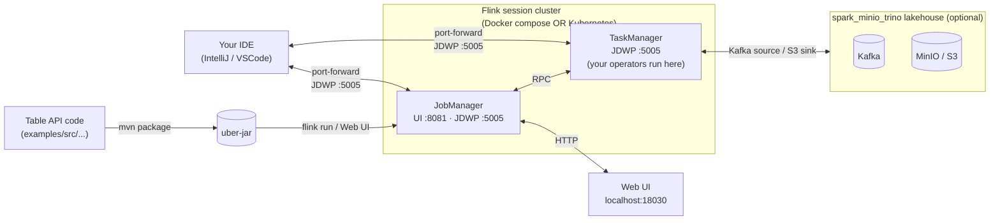

con# Flink Table API tutorial

Develop, run, and **debug** Flink Table API jobs against a session cluster — Docker Compose **or** Kubernetes — with the Web UI accessible from your browser and a JVM debugger attachable from your IDE.



## What you get

| Capability | Docker Compose | Kubernetes |
|---|---|---|
| Single-JM + single-TM session cluster | ✅ | ✅ |
| Web UI from your browser | `http://127.0.0.1:18030` | `http://localhost:30030` (NodePort) **or** `kubectl port-forward` |
| Submit jars from CLI | `./scripts/submit.sh ClassName` | `./scripts/k8s-submit.sh ClassName` |
| Submit jars from Web UI | yes (`web.submit.enable: true`) | yes |
| JDWP debugger on JobManager | `localhost:18040` | `kubectl port-forward ... 5005:5005` |
| JDWP debugger on TaskManager | `localhost:18041` | `kubectl port-forward ... 5005:5005` |
| Reuses your existing Kafka/MinIO | ✅ via `lakehouse-network` | ✅ via in-cluster service names |

## Prerequisites

- Docker / Rancher Desktop with Kubernetes enabled
- Java 11+ and Maven (for building examples)
- The lakehouse stack from `../spark_minio_trino` if you want to run the Kafka examples — see the project [README](../README.md#bringing-up-the-lakehouse-stack)
- An IDE that speaks JDWP (IntelliJ IDEA, VSCode with the Java extension pack, Eclipse — anything that does "Remote JVM Debug")

## Path 1: Docker Compose (start here)

This is the fastest path. The Flink containers join the same `lakehouse-network` your Kafka/MinIO/Trino are on, so jobs can reach them by container name.

```bash
cd flink-tutorial

# 1. Build the example uber-jar
./scripts/build.sh

# 2. Bring up the cluster
./scripts/up.sh

# 3. Submit the hello-world Table API job
./scripts/submit.sh com.example.flink.HelloTableApi
```

Open the Web UI: **http://127.0.0.1:18030/**. You should see one running job under `Running Jobs`. Click into it — the **`Task Managers`** tab shows the running TM, and clicking it opens its `Stdout` log where the `print` connector dumps each window's results.

To submit the Kafka example (requires the lakehouse stack to be up and producing data):

```bash
./scripts/submit.sh com.example.flink.KafkaToConsoleTableApi

# In another terminal, drive some traffic:
cd ..
python3 test_e2e.py
```

Tear down: `./scripts/down.sh`.

## Path 2: Kubernetes (Rancher Desktop or Docker Desktop)

```bash
cd flink-tutorial

# 1. Build the jar (same as before — k8s consumes the same jar)
./scripts/build.sh

# 2. Apply manifests + wait for ready
./scripts/k8s-up.sh

# 3. Submit
./scripts/k8s-submit.sh com.example.flink.HelloTableApi
```

Two ways to access the Web UI:

- **NodePort (no setup):** http://localhost:30030 — Rancher / Docker Desktop both forward NodePorts to localhost.
- **Port-forward (preferred for ephemeral access):**
  ```bash
  kubectl -n flink-tutorial port-forward svc/flink-jobmanager 18030:8081
  ```

Tear down: `./scripts/k8s-down.sh`.

## Debugging — attach an IDE

The JVMs in both deployments boot with `-agentlib:jdwp=transport=dt_socket,server=y,suspend=n,address=*:5005`. **Important distinction:**

- **JobManager JVM** runs the `main()` of your job *only at submit time* (planning the query, building the JobGraph). Most of your code executes elsewhere.
- **TaskManager JVM** runs the *operators* — the per-record logic, the table joins, the window aggregations. **This is where most "what is my data doing" debugging happens.**

For Table API specifically: the SQL planning + query optimization happens on the JobManager; the generated runtime code (the actual operator chain) runs on the TaskManagers.

### Attach via Docker Compose

JDWP is already exposed on host ports:

| JVM | Host port |
|---|---|
| JobManager | `localhost:18040` |
| TaskManager | `localhost:18041` |

### Attach via Kubernetes

JDWP is on container port 5005 in each pod. Open a port-forward in a terminal and leave it running:

```bash
# JobManager
kubectl -n flink-tutorial port-forward svc/flink-jobmanager 18040:5005 &

# TaskManager
kubectl -n flink-tutorial port-forward svc/flink-taskmanager 18041:5005 &
```

(If the TaskManager pod restarts, restart the port-forward.)

### IntelliJ IDEA — Remote JVM Debug

1. **Run → Edit Configurations → + → Remote JVM Debug**
2. Settings:
   - Debugger mode: **Attach to remote JVM**
   - Host: `localhost`
   - Port: `18041` (TaskManager) or `18040` (JobManager)
   - Use module classpath: pick the `flink-table-tutorial` module
3. Save and run the configuration. IntelliJ should connect within a second.
4. Set breakpoints in your Table API code (e.g. inside a UDF or inside an `executeInsert(...)` call). Submit your job (`./scripts/submit.sh ...`). Operators will hit your breakpoints when records flow through.

### VSCode — Java Debugger

Add to `.vscode/launch.json`:

```json
{
  "version": "0.2.0",
  "configurations": [
    {
      "type": "java",
      "name": "Attach to Flink TaskManager",
      "request": "attach",
      "hostName": "localhost",
      "port": 18041
    },
    {
      "type": "java",
      "name": "Attach to Flink JobManager",
      "request": "attach",
      "hostName": "localhost",
      "port": 18040
    }
  ]
}
```

Then **Run and Debug → Attach to Flink TaskManager**.

### Pause the JVM until your debugger attaches

If you want to step through your job from the very first line of `main()` (useful for debugging Table API plan generation), set `suspend=y`:

```bash
# Compose
FLINK_DEBUG_SUSPEND=y ./scripts/up.sh

# Kubernetes — edit k8s/20-jobmanager.yaml or k8s/30-taskmanager.yaml,
# change suspend=n to suspend=y, then:
kubectl apply -f k8s/
```

The JVM will block at startup until you connect a debugger. Do this only when actively debugging — left on, the cluster won't start.

## Project layout

```
flink-tutorial/
├── README.md                      this file
├── compose/
│   └── docker-compose.yml         JM + TM session cluster, JDWP enabled
├── k8s/
│   ├── 00-namespace.yaml
│   ├── 10-flink-config.yaml       ConfigMap with flink-conf.yaml + log4j
│   ├── 20-jobmanager.yaml         Deployment + ClusterIP + NodePort
│   └── 30-taskmanager.yaml        Deployment + ClusterIP
├── examples/
│   ├── pom.xml                    builds an uber-jar; Flink core is `provided`
│   └── src/main/java/com/example/flink/
│       ├── HelloTableApi.java                    datagen → print
│       └── KafkaToConsoleTableApi.java           kafka envelope → SQL → print
└── scripts/
    ├── up.sh / down.sh            compose lifecycle
    ├── k8s-up.sh / k8s-down.sh    k8s lifecycle
    ├── build.sh                   mvn package
    ├── submit.sh                  compose: docker cp + flink run
    └── k8s-submit.sh              k8s: kubectl cp + kubectl exec flink run
```

## Port map

Devportal-coordinated, in the same 18000-18099 range as the rest of this project's lakehouse:

| Purpose | Compose host port | K8s NodePort | K8s in-cluster |
|---|---|---|---|
| Flink Web UI / REST | **18030** | **30030** | `flink-jobmanager.flink-tutorial:8081` |
| JobManager JDWP | **18040** | (port-forward) | `flink-jobmanager.flink-tutorial:5005` |
| TaskManager JDWP | **18041** | (port-forward) | `flink-taskmanager.flink-tutorial:5005` |
| JM RPC | not exposed | (port-forward) | `flink-jobmanager.flink-tutorial:6123` |
| JM BLOB | not exposed | (port-forward) | `flink-jobmanager.flink-tutorial:6124` |

## Common gotchas

- **`web.submit.enable` is on by default.** Don't expose this Web UI to the open internet — anyone reachable can submit jars.
- **Bundled vs provided dependencies.** Flink's core (`flink-streaming-java`, `flink-table-*`) ships with the cluster — keep them at `<scope>provided</scope>`. Connectors (`flink-connector-kafka`, `flink-json`, `flink-connector-files`) are NOT on the cluster classpath by default — bundle them into your uber-jar (the example `pom.xml` does this with the shade plugin).
- **TaskManager only sees jars submitted with the job.** If you drop jars into `/opt/flink/lib` on the JM but not the TM, the TM-side operators will fail with `ClassNotFoundException`. Either bundle into your uber-jar (recommended) or mount jars into BOTH containers.
- **DNS for inter-container hostnames** is `kafka` (compose) or `kafka.spark-minio-trino` (k8s; depends on your namespace). The Kafka example uses `kafka:29092` because the lakehouse compose puts everything on the same network. In k8s you'll need to add Kafka to the `flink-tutorial` namespace OR use a fully-qualified `kafka.<other-namespace>.svc.cluster.local:29092`.
- **JDWP doesn't authenticate.** It's wide open to anyone who can reach the port. Fine on a dev laptop; never expose port 5005 to anything else.
- **`suspend=y` on the TaskManager will hang job submission.** The TM JVM blocks at startup; the JM can't register the TM, so submission spins forever. Only use suspend=y on the JM, not the TM, unless you really want both blocking.
- **Watermarks in the Kafka example.** The example uses `proc_time` (processing time) for windowing because the source records' `timestamp` field is a string, not Flink's TIMESTAMP_LTZ. To use event-time, parse the string into a TIMESTAMP_LTZ column and define a `WATERMARK FOR ...`.
- **Long checkpoints / state.** This tutorial's session cluster has no state backend configured — it uses the default in-memory one. For real workloads, switch to `rocksdb` and configure a checkpoint dir (`s3a://warehouse/flink-checkpoints/`).

## What to read next

- [Flink Table API & SQL docs (1.18)](https://nightlies.apache.org/flink/flink-docs-release-1.18/docs/dev/table/overview/)
- [Flink Kafka connector](https://nightlies.apache.org/flink/flink-docs-release-1.18/docs/connectors/table/kafka/)
- [Flink session-cluster mode on Kubernetes](https://nightlies.apache.org/flink/flink-docs-release-1.18/docs/deployment/resource-providers/standalone/kubernetes/)
- [Flink + Iceberg](https://iceberg.apache.org/docs/latest/flink/) — for writing to your Iceberg tables (companion to the existing Spark consumer)
