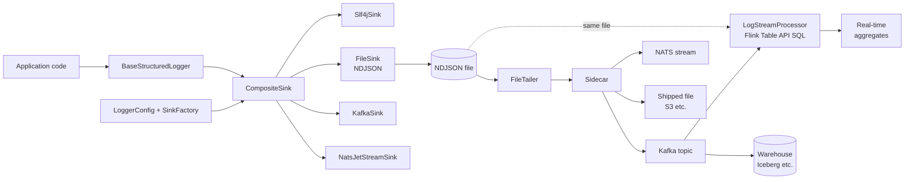
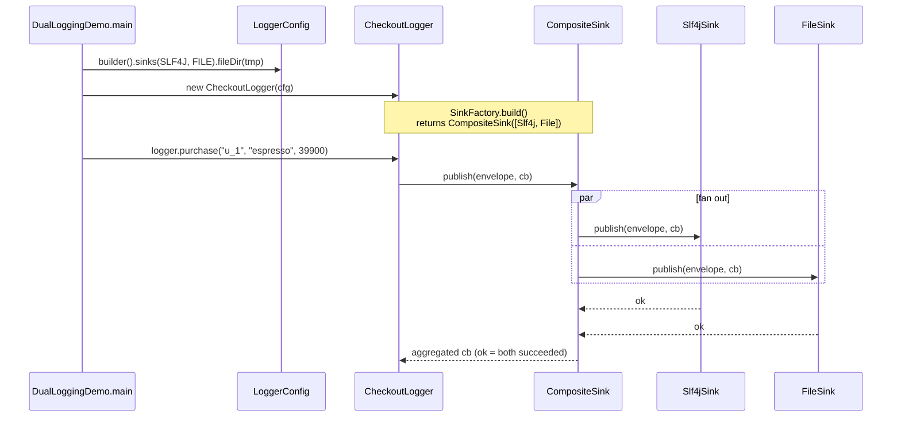
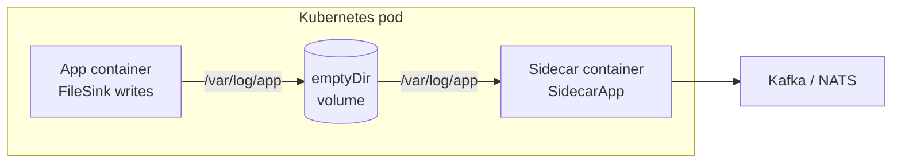

# structured-logging-java

Multi-module Java logging library that lets one log API target multiple
delivery paths and feeds a Flink-based stream processor for SQL-driven
real-time analytics.

```
java-logger/
├── core/              -- the logging API + pluggable sinks
├── sidecar/           -- standalone agent that tails NDJSON files and ships them
├── stream-processor/  -- Flink Table API jobs (Kafka/file source, SQL transforms)
└── demos/             -- runnable end-to-end examples
```

## Architecture at a glance



Same envelope shape — `_log_type`, `_log_class`, `_version`, `data` — flows through every transport. That's what makes the sidecar and stream processor transport-agnostic.

## What's new vs. the original Kafka-only logger

1. **Configurable backends.** The same `logger.log(...)` call can fan out to
   any combination of: Kafka, NATS JetStream, a local NDJSON file, SLF4J
   (so existing log appenders keep working), or `null` for tests. Sinks are
   composed at deploy time via env vars — no code changes:

   ```bash
   STRUCTURED_LOG_SINKS=kafka,slf4j        # publish to Kafka and SLF4J at once
   STRUCTURED_LOG_SINKS=file               # cheapest hot path; sidecar ships
   STRUCTURED_LOG_SINKS=nats               # NATS JetStream alternative to Kafka
   ```

   Programmatic config via `LoggerConfig.builder()` is also supported.

2. **Delivery sidecar.** A separate `structured-logging-sidecar` JAR tails
   the NDJSON files written by `FileSink` and forwards each record to Kafka,
   NATS JetStream, or another file. Lets the application pay only the cost
   of a buffered local write while keeping at-least-once delivery via a
   persisted byte-offset checkpoint. Runs equally well as a kubernetes
   sidecar container (sharing an `emptyDir` volume with the app) or as a
   systemd service tailing `/var/log/app`.

3. **Flink Table API stream processor.** The
   `structured-logging-stream-processor` module composes Flink jobs from
   pluggable `StreamSource` / `StreamSink` descriptors and SQL strings. The
   bundled `UserEventsAggregationJob` shows a 1-minute tumbling window count
   by event_type. Sources currently include Kafka and filesystem (NDJSON
   replay); add more by implementing `StreamSource`.

## Cost / time tradeoffs

| Sink             | Hot-path cost              | E2E latency | Durability         | Best for                                  |
|------------------|----------------------------|-------------|--------------------|-------------------------------------------|
| `SLF4J`          | ~µs (in-process)           | depends     | depends            | drop-in compatibility with existing log infra |
| `FILE`           | ~µs (buffered write)       | seconds     | survives crash     | high-volume hot paths; pair with sidecar  |
| `KAFKA`          | low ms (network + acks=1)  | ms          | replicated         | when you already have a Kafka cluster     |
| `NATS` JetStream | sub-ms (light protocol)    | ms          | persistent stream  | edge / on-prem / k8s without ZK or Kraft  |
| Composite        | sum of children            | max of children | tee semantics  | dual-logging during migrations            |

## Running the demos

Build everything first:

```bash
./build.sh
```

Then either run a single demo via `./run-demo-<name>.sh` or run them all back-to-back:

```bash
./run-all-demos.sh           # dual + sidecar + flink-warehouse + flink-stream-only
./run-demo-dual.sh           # SLF4J + file
./run-demo-sidecar.sh        # one-shot file -> sidecar -> file
./run-demo-sidecar-live.sh   # long-running pipeline; tail /tmp/sl-demo/
./run-demo-flink-warehouse.sh
./run-demo-flink-stream-only.sh
./run-demo-nats.sh           # needs a NATS broker
```

---

## Demos walkthrough

Each demo below pairs a flow diagram with pointers to the exact code that does the work. Click any path to jump to the relevant file.

### Demo 1 — dual logging (SLF4J + file)

**Goal:** show that one `logger.log(...)` call can land in two places at once — your existing SLF4J appenders **and** a structured NDJSON file.



**Where each step lives:**

| Step | File:line |
|--|--|
| Demo entry point | [`demos/src/main/java/com/logging/demo/DualLoggingDemo.java:35`](demos/src/main/java/com/logging/demo/DualLoggingDemo.java) |
| `CompositeSink` choice based on `LoggerConfig` | [`core/src/main/java/com/logging/config/SinkFactory.java:40`](core/src/main/java/com/logging/config/SinkFactory.java) |
| Fan-out to children | [`core/src/main/java/com/logging/sink/CompositeSink.java:48`](core/src/main/java/com/logging/sink/CompositeSink.java) |
| `Slf4jSink.publish` | [`core/src/main/java/com/logging/sink/Slf4jSink.java`](core/src/main/java/com/logging/sink/Slf4jSink.java) |
| `FileSink.publish` (NDJSON line) | [`core/src/main/java/com/logging/sink/FileSink.java:74`](core/src/main/java/com/logging/sink/FileSink.java) |

---

### Demo 2 — file → sidecar → file

**Goal:** show the cheapest hot path. The application only writes locally; a separate sidecar tails the file and forwards records to a downstream sink. Same shape as production where the downstream is Kafka or NATS — only the sidecar's `targetSink` differs.

```mermaid
flowchart LR
    subgraph App[Application JVM]
        AppCode[OrderLogger.place&#40;...&#41;]
        AppSink[FileSink]
    end
    subgraph Disk[Shared volume / emptyDir]
        Source[/orders.ndjson/]
        CP[/positions.json<br/>checkpoint/]
    end
    subgraph SC[Sidecar JVM/process]
        Tailer[FileTailer<br/>polls every 500ms]
        Forward[Sidecar.forward&#40;line&#41;]
        OutSink[Target LogSink<br/>KafkaSink / NatsJetStreamSink / FileSink]
    end
    Out[(Kafka / NATS / S3)]

    AppCode --> AppSink
    AppSink -- buffered writes --> Source
    Tailer -- read since last offset --> Source
    Tailer -- update --> CP
    Tailer --> Forward
    Forward --> OutSink
    OutSink --> Out
```



**Where each step lives:**

| Step | File:line |
|--|--|
| Demo entry point (one-shot) | [`demos/src/main/java/com/logging/demo/FileSinkSidecarDemo.java:42`](demos/src/main/java/com/logging/demo/FileSinkSidecarDemo.java) |
| Live demo (continuous producer) | [`demos/src/main/java/com/logging/demo/LiveSidecarDemo.java:37`](demos/src/main/java/com/logging/demo/LiveSidecarDemo.java) |
| App writes NDJSON | [`core/src/main/java/com/logging/sink/FileSink.java:74`](core/src/main/java/com/logging/sink/FileSink.java) |
| Tailer reads since last offset | [`sidecar/src/main/java/com/logging/sidecar/FileTailer.java:100`](sidecar/src/main/java/com/logging/sidecar/FileTailer.java) |
| Crash-safe checkpoint | [`sidecar/src/main/java/com/logging/sidecar/Checkpoint.java:59`](sidecar/src/main/java/com/logging/sidecar/Checkpoint.java) |
| Re-parse + forward | [`sidecar/src/main/java/com/logging/sidecar/Sidecar.java:113`](sidecar/src/main/java/com/logging/sidecar/Sidecar.java) |
| Target sink selection | [`sidecar/src/main/java/com/logging/sidecar/Sidecar.java:69`](sidecar/src/main/java/com/logging/sidecar/Sidecar.java) |

The live version writes to fixed paths so you can `tail -f` while it runs:

```bash
./run-demo-sidecar-live.sh                          # in terminal 1
tail -f /tmp/sl-demo/shipped/delivered.ndjson       # in terminal 2
tail -f /tmp/sl-demo/app-logs/orders.ndjson         # in terminal 3
watch -n 1 cat /tmp/sl-demo/positions.json          # see the checkpoint advance
```

---

### Demo 3 — NATS JetStream

**Goal:** publish straight to a lightweight broker as an alternative to Kafka. Same `logger.log` API; only the configured sink type changes.

```mermaid
flowchart LR
    App[TelemetryLogger.cpu&#40;...&#41;]
    Sink[NatsJetStreamSink]
    Subj{logs.telemetry}
    Stream[(JetStream<br/>persistent stream)]
    Sub[Consumer<br/>nats sub 'logs.&gt;']

    App --> Sink
    Sink -- subject = subjectPrefix + '.' + log_type --> Subj
    Subj --> Stream
    Stream --> Sub
```



**Where each step lives:**

| Step | File:line |
|--|--|
| Demo entry point | [`demos/src/main/java/com/logging/demo/NatsJetStreamDemo.java`](demos/src/main/java/com/logging/demo/NatsJetStreamDemo.java) |
| Subject naming + JetStream publish | [`core/src/main/java/com/logging/sink/NatsJetStreamSink.java`](core/src/main/java/com/logging/sink/NatsJetStreamSink.java) |
| Optional-dependency reflection so apps that don't use NATS aren't forced to depend on `jnats` | [`core/src/main/java/com/logging/config/SinkFactory.java:90`](core/src/main/java/com/logging/config/SinkFactory.java) |

Prereq: `docker run --rm -p 4222:4222 nats:2.10 -js`.

---

### Demo 4a — warehouse + streaming (Flink Table API)

**Goal:** show that one log file can serve **two** consumers simultaneously — the warehouse path (sidecar → Iceberg) and a real-time SQL aggregation in Flink. This is the dual-purpose pattern: same source of truth, two independent readers.

```mermaid
flowchart LR
    App[UserEventsLogger.event&#40;...&#41;]
    AppSink[FileSink]
    NDJSON[(/tmp/sl-flink-demo/<br/>warehouse/userevents.ndjson)]
    Sidecar[Sidecar<br/>FileTailer]
    Warehouse[(Iceberg /<br/>S3 / Trino)]
    Flink[Flink Table API<br/>StreamTableEnvironment]
    SQL["GROUP BY data.event_type"]
    Out[Real-time aggregates<br/>click=110, purchase=33, scroll=57]

    App --> AppSink
    AppSink --> NDJSON
    NDJSON -. tail .-> Sidecar
    Sidecar --> Warehouse
    NDJSON -- filesystem connector --> Flink
    Flink --> SQL
    SQL --> Out
```



**Where each step lives:**

| Step | File:line |
|--|--|
| Demo entry point | [`stream-processor/src/main/java/com/logging/stream/demos/WarehouseAndStreamingDemo.java:55`](stream-processor/src/main/java/com/logging/stream/demos/WarehouseAndStreamingDemo.java) |
| Producer (FileSink) | same file, lines 68-80 |
| Flink filesystem source DDL | [`stream-processor/src/main/java/com/logging/stream/sources/FilesystemJsonSource.java`](stream-processor/src/main/java/com/logging/stream/sources/FilesystemJsonSource.java) |
| SQL (`GROUP BY data.event_type`) | [`WarehouseAndStreamingDemo.java:98-104`](stream-processor/src/main/java/com/logging/stream/demos/WarehouseAndStreamingDemo.java) |
| Update-stream final-state collection | same file, lines 111-126 |

The source NDJSON file remains on disk after the demo — that's the warehouse path: a sidecar would ship it to Iceberg/S3 while Flink consumed the same bytes for streaming aggregation.

---

### Demo 4b — streaming-only (tumbling windows)

**Goal:** show high-volume ephemeral events where only the rollup matters (heartbeats, RPM counters, etc.). Source files have short retention; only the windowed aggregates leaving Flink are kept.

```mermaid
flowchart LR
    App[SessionPingLogger.ping&#40;...&#41;<br/>600 records, 30s span]
    AppSink[FileSink]
    NDJSON[(/tmp/sl-flink-demo/<br/>stream-only/sessionpings.ndjson)]
    Flink[Flink Table API<br/>WATERMARK + TUMBLE]
    Window[5-second tumbling windows<br/>per region]
    Rollup[(21 rollup rows<br/>kept long-term)]
    Discard[Source NDJSON<br/>discarded after retention]

    App --> AppSink
    AppSink --> NDJSON
    NDJSON --> Flink
    Flink --> Window
    Window --> Rollup
    NDJSON -.short retention.-> Discard
```



The SQL:

```sql
SELECT
  window_start,
  data.region AS region,
  COUNT(*) AS active_pings
FROM TABLE(TUMBLE(TABLE pings, DESCRIPTOR(event_time), INTERVAL '5' SECOND))
WHERE _log_type = 'session_ping'
GROUP BY window_start, window_end, data.region
```

**Where each step lives:**

| Step | File:line |
|--|--|
| Demo entry point | [`stream-processor/src/main/java/com/logging/stream/demos/StreamOnlyDemo.java:57`](stream-processor/src/main/java/com/logging/stream/demos/StreamOnlyDemo.java) |
| Producer with epoch-millis timestamps | same file, lines 74-85 |
| Inline DDL with `WATERMARK FOR event_time` | same file, lines 99-113 |
| TUMBLE TVF SQL | same file, lines 115-124 |

The watermark + epoch-millis trick is required because Flink's CAST does not parse ISO-8601 with a `Z` suffix; the producer emits `ts_millis` as a `BIGINT` and the table DDL converts via `TO_TIMESTAMP_LTZ(data.ts_millis, 3)`.

---

### When does each demo's pattern apply?

| Pattern | Use when |
|--|--|
| **Demo 1** dual logging | migrating an existing app onto structured logs without breaking SLF4J appenders |
| **Demo 2** file → sidecar | hot-path latency matters; you want a broker outage to back up to disk, not memory |
| **Demo 3** NATS direct | edge / on-prem / k8s where running a Kafka cluster is overkill |
| **Demo 4a** warehouse + streaming | analytics + real-time signals; same log feeds both — like Kafka with two consumer groups |
| **Demo 4b** streaming-only | metrics/heartbeats where individual events have no analytical value, only rollups |

---

## Running the sidecar in production

Standalone:

```bash
SIDECAR_WATCH_DIR=/var/log/app \
SIDECAR_TARGET=KAFKA \
SIDECAR_TARGET_TOPIC=logs.shared \
KAFKA_BOOTSTRAP_SERVERS=broker:9092 \
java -jar sidecar/target/structured-logging-sidecar-*.jar
```

Kubernetes — use the same env vars on a sidecar container that mounts the
same `emptyDir` volume the application writes to.



| Step | File:line |
|--|--|
| Process entry point + shutdown hook | [`sidecar/src/main/java/com/logging/sidecar/SidecarApp.java`](sidecar/src/main/java/com/logging/sidecar/SidecarApp.java) |
| Env-var-driven configuration | [`sidecar/src/main/java/com/logging/sidecar/SidecarConfig.java`](sidecar/src/main/java/com/logging/sidecar/SidecarConfig.java) |

## Running the Flink job against Kafka

```bash
KAFKA_BOOTSTRAP_SERVERS=broker:9092 \
LOGS_TOPIC=logs.shared \
java -cp "stream-processor/target/classes:stream-processor/target/lib/*" \
  com.logging.stream.jobs.UserEventsAggregationJob
```

For production, package the job and submit to a Flink cluster. For local
development the in-process StreamExecutionEnvironment runs the job
directly.

## Tests

```bash
./test.sh           # wraps `mvn verify` and prints a per-module summary
# OR
mvn verify
```

31 tests across 4 modules cover:

- Sink unit tests (file rotation, composite tee semantics, envelope shape)
- Logger config parsing (env vars → `LoggerConfig` → `LogSink`)
- Sidecar (file tailer, checkpoint resume, end-to-end pipeline)
- Flink (real mini-cluster running SQL aggregation over NDJSON)
- Demos (dual-logging file output, sidecar pipeline, both Flink demos)

No test requires Kafka, NATS, or any external service.

## Backwards compatibility

The original `BaseStructuredLogger(topic, name, type, version)` and
`(..., kafkaBootstrapServers)` constructors still exist and still default to
a Kafka sink. The four pre-existing generated loggers
(`UserEventsLogger`, `ApiMetricsLogger`, `UserActivityLogger`,
`UserActivityLogLogger`) compile and run unmodified. Setting
`STRUCTURED_LOG_SINKS` opts the same loggers into the new sink mix without
regenerating code.
